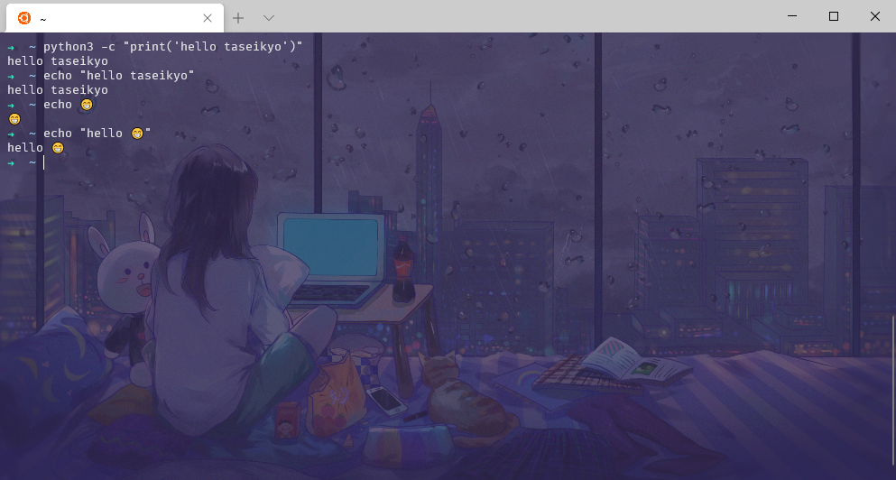

> @Date    : 2020-10-22 19:48:12
>
> @Author  : Lewis Tian (taseikyo@gmail.com)
>
> @Link    : github.com/taseikyo

<p align="center">
	<a href="#readme">
</p>

## Table of Contents

- [前言](#前言)
- [环境准备](#环境准备)
- [自定义 terminal](#自定义-terminal)
- [Ubuntu 换源与更新](#ubuntu-换源与更新)
- [安装与配置 oh-my-zsh、autojump 和 autosuggestions](#安装与配置-oh-my-zshautojump-和-autosuggestions)
- [License](#license)

## 前言

记得去年 terminal 刚出那会心血来潮用了一段时间，还写了篇博客：【win10 terminal 初体验 & 美化】，然而很多还是不太行，很多快捷键、命令都没有。比如清除当前行的命令：`ctrl+u`，回到当前命令的头和尾：`ctrl+a/e`，这些都没有。再比如 `more/less/sort` 等等命令都没有。所以用了一段时间之后又换回 [cmder](https://cmder.net/) 了，cmder 挺好用的，集成了很多快捷键命令，所以用起来很舒服，但是还是缺了点味，有些命令还是不太行

如今 wsl2 来了，好像更新了很多东西，于是又打算试试水

下面部分内容参考：[ErickRock/oh-my-zsh-on-windows-terminal](https://github.com/ErickRock/oh-my-zsh-on-windows-terminal)

## 环境准备

1. 安装 [Fira 代码字体](https://github.com/tonsky/FiraCode/releases/download/2/FiraCode_2.zip)，可以去 [GitHub-Fira Code](https://github.com/tonsky/FiraCode) 查看更多详细信息。其实装不装没啥关系，因为我个人更喜欢 Microsoft Yahei Mono 这个字体，这是个中西合璧字体
2. 启用 Windows Linux 子系统和相关虚拟机组件

```Bash
dism.exe /online /enable-feature /featurename:Microsoft-Windows-Subsystem-Linux /all /norestart
dism.exe /online /enable-feature /featurename:VirtualMachinePlatform /all /norestart
```

3. 安装 [Windows Terminal](https://www.microsoft.com/zh-cn/p/windows-terminal-preview/9n0dx20hk701?activetab=pivot:overviewtab)，点击链接会弹出打开微软应用商店的窗口，安装即可
4. 然后我们需要一个 Linux 发行版，我自己装的是 Ubuntu 20.04。装完后它会出现在开始菜单列表，点击运行，它会装一些东西，然后让你输入用户名密码，完了就可以使用了，暂时先退出，我们先进行下面的步骤
5. 在这里我漏掉了一步，导致我一直使用的是 wsl1 而不是 wsl2，默认安装版本其实是 wsl1。使用 `wsl --list --verbose` 命令就可以看到 VERSION 是 1，在安装一个 Ubuntu 之前应该使用命令：`wsl --set-default-version 2` 设置默认版本为 wsl2。但其实也没关系，因为有命令可以转换：`wsl --set-version Ubuntu-20.04 2`，在这一步可能有问题，见 [Failure converting WSL1 distro to WSL2](https://github.com/microsoft/WSL/issues/4626)，在我的笔记本上是没问题的，大概两三分钟就转换好了：

```Bash
PS C:\WINDOWS\system32> wsl --list --verbose
  NAME            STATE           VERSION
* Ubuntu-20.04    Stopped         1
PS C:\WINDOWS\system32> wsl --set-version Ubuntu-20.04 2
正在进行转换，这可能需要几分钟时间...
有关与 WSL 2 的主要区别的信息，请访问 https://aka.ms/wsl2
转换完成。
PS C:\WINDOWS\system32> wsl --list --verbose
  NAME            STATE           VERSION
* Ubuntu-20.04    Stopped         2
```

如果升级报错："由于虚拟磁盘系统限制，无法完成请求的操作。虚拟硬盘文件必须是未压缩和未加密的文件，并且不能是稀疏文件。"

那么找到 ubuntu 的文件目录，如："%LOCALAPPDATA%\Packages\CanonicalGroupLimited.Ubuntu20.04onWindows_79rhkp1fndgsc"

右键 "LocalState" -> 属性 -> 高级 -> 取消选择压缩文件（如果加密文件被选择了的话也要取消一下） -> 选择仅此文件夹

再次运行就没问题了

## 自定义 terminal

为了日常使用，我们需要将 terminal 添加到右键菜单，具体参考 [新发布的Windows Terminal如何添加到右键菜单？](https://www.zhihu.com/question/325948326/answer/700753639)：

1. 测试后续要用的两个常量是否正常

```Bash
# 打开 CMD
echo %USERPROFILE%
echo %LOCALAPPDATA%
```

如果输出的不是对应的路径，在后面步骤中手动进行如下替换：

```Bash
%USERPROFILE% → C:\Users\[userName]
%LOCALAPPDATA% → C:\Users\[userName]\AppData\Local
```

2. 新建目录，在 CMD 中运行 `mkdir "%USERPROFILE%\AppData\Local\terminal"`
3. 自己找个 ico 图片作为右键菜单中 terminal 的图标，命名为 `wt.ico`，将其放到 `%USERPROFILE%\AppData\Local\terminal` 目录下，我是直接从 `C:\Program Files\WindowsApps\Microsoft.WindowsTerminal_1.3.2651.0_x64__8wekyb3d8bbwe\Images` 找的一个
4. 将如下内容另存为 wt.reg，直接双击运行即可，注意修改用户名

```Bash
Windows Registry Editor Version 5.00

[HKEY_CLASSES_ROOT\Directory\Background\shell\wt]
@="Windows terminal here"
"Icon"="%USERPROFILE%\\AppData\\Local\\terminal\\wt.ico"

[HKEY_CLASSES_ROOT\Directory\Background\shell\wt\command]
@="C:\\Users\\me\\AppData\\Local\\Microsoft\\WindowsApps\\wt.exe"
```

5. 将配置文件中 startingDirectory 属性改为 `"."`。做到这里，你随便在一个文件夹中右键应该都能打开 terminal，并且路径就是当前目录。如果没有成功，检查前面的步骤是否有问题

然后就是修改配置文件，进行各种魔改，修改配色，字体等等，这里可以自行修改，按自己的爱好来。最重要的是我们将默认启动设置为前面安装的 Ubuntu 20.04：

```json
"defaultProfile": "{07b52e3e-de2c-5db4-bd2d-ba144ed6c273}",
```

上面括号中的一串数字就是 Ubuntu 20.04 的 ID，在配置文件中的 `profiles - list` 中可以找到

另外在你的 Ubuntu 20.04 中可以加入一个 icon 属性，即图标路径，我从 [这里](https://github.com/ErickRock/oh-my-zsh-on-windows-terminal/blob/master/SysIcon/Ubuntu.png) 直接拿的，现在在 images 目录下可以直接拿，自己找一张也行

```json
{
    "guid": "{07b52e3e-de2c-5db4-bd2d-ba144ed6c273}",
    "hidden": false,
    "name": "Ubuntu-20.04",
    "icon": "C:/Users/me/AppData/Local/terminal/Ubuntu.png",
    "source": "Windows.Terminal.Wsl"
}
```

6. PowerShell 管理员模式

见 [w21@tip#2](https://github.com/taseikyo/arts/blob/master/weekly/202103W4.md#2-windows-terminal-以管理员身份打开-powershell)

## Ubuntu 换源与更新

```Bash
sudo cp /etc/apt/sources.list /etc/apt/sources.list.bak
sudo vim /etc/apt/sources.list
```

可以搜到很多源，我一般使用清华源：

```Markdown
# 添加清华源
deb https://mirrors.tuna.tsinghua.edu.cn/ubuntu/ focal main restricted universe multiverse
# deb-src https://mirrors.tuna.tsinghua.edu.cn/ubuntu/ focal main restricted universe multiverse
deb https://mirrors.tuna.tsinghua.edu.cn/ubuntu/ focal-updates main restricted universe multiverse
# deb-src https://mirrors.tuna.tsinghua.edu.cn/ubuntu/ focal-updates main restricted universe multiverse
deb https://mirrors.tuna.tsinghua.edu.cn/ubuntu/ focal-backports main restricted universe multiverse
# deb-src https://mirrors.tuna.tsinghua.edu.cn/ubuntu/ focal-backports main restricted universe multiverse
deb https://mirrors.tuna.tsinghua.edu.cn/ubuntu/ focal-security main restricted universe multiverse
# deb-src https://mirrors.tuna.tsinghua.edu.cn/ubuntu/ focal-security main restricted universe multiverse multiverse
```

```Bash
sudo apt-get update
sudo apt-get upgrade
```

## 安装与配置 oh-my-zsh、autojump 和 autosuggestions

1. 安装 zsh、oh-my-zsh

在安装过程中会提示将默认的 shell 改成 zsh，这里选否后面也可以改

```bash
sudo apt install zsh
sh -c "$(wget https://raw.githubusercontent.com/robbyrussell/oh-my-zsh/master/tools/install.sh -O -)"
```

替换默认 shell，如果上一步选择替换，则这一步可以跳过。在 terminal 中输入以下命令可以在 vscode 中编辑文件（ErickRock/oh-my-zsh-on-windows-terminal 中是安装了 Remote-WSL 扩展的，我没装也能用 vscode 打开，应该是个可选项）：

```Bash
cd ~
code /etc/passwd
```

将你用户名最后的 bash 改成 zsh，后面再启动 terminal 使用的默认 shell 就是 zsh 了

2. 修改主题

- https://github.com/robbyrussell/oh-my-zsh/wiki/Themes 

上面链接中有很多主题，我以前很喜欢 agnoster 主题，最近比较魔性，我直接 random，每次都随机不确定很好玩 :p

```Bash
code ~/.zshrc
# ZSH_THEME="random"
```

3. autojump

当你习惯了 autojump 操作之后，没了它就会觉得十分别扭

```Bash
sudo apt install autojump
```

在 zsh 的配置文件中加上 `. /usr/share/autojump/autojump.sh`

最后 `source ~/.zshrc` 大功告成！

一个栗子：

```Bash
me@ubuntu20.04 ~
☺  cd desktop/foo/deepfoo
me@ubuntu20.04 ~/desktop/foo/deepfoo
☺  cd ~
me@ubuntu20.04 ~
☺  j foo__
/home/me/desktop/foo
me@ubuntu20.04 ~/desktop/foo
☺
```

4. autosuggestions

这个插件是我必装的，前面的 jump 我可能不一定

首先，将该插件 clone 到 `oh-my-zsh` 的插件目录

```Bash
git clone git://github.com/zsh-users/zsh-autosuggestions $ZSH_CUSTOM/plugins/zsh-autosuggestions
```

然后在配置文件中启用改插件：

```Bash
code ~/.zshrc
# plugins=(git) -> plugins=(git zsh-autosuggestions)
```

这个插件会根据你当前命令，以前缀匹配的方式提示之前运行过的命令，比如你之前运行过 `sudo apt-get install xxx`，下一次当你输入 `sudo apt` 他就会有提示前面那条历史命令的提示，对于健忘症患者很友好（所以我十分依赖这个插件

5. 自定义 alias 和脚本

将自定义的 alias 和一些环境变量放入 `~/.myrc`，然后在配置文件（`.zshrc` 和 `.bashrc`）中 source 一下就 OK 了，这里放入了一些常用的命令，比如 `sudo apt install` => `sai`，`ps aux | grep` => `paux`

zsh 和 bash 会记录重复的历史命令，所以我写了个脚本清理，每次登录都会运行改脚本，具体见 [remove_duplicate_cmds.py](https://github.com/taseikyo/backup-utils/blob/master/Python/00E_remove_duplicate_history_cmds.py)，需要自行下载保存到自己的 home 目录（`/home/me/remove_duplicate_cmds.py`）

6. 打开 Windows 程序无需去除 `.exe` 后缀

- https://blog.csdn.net/qq_21415979/article/details/111479223

参考上述 CSDN 链接给出的方法，一共有两个：

```Bash
# 1. 单个win程序 可以使用别名的方式
# 打开.zshrc
vim ~/.zshrc
# 将以下命令添加到 .zshrc
# alias adb=adb.exe
alias 别名=程序名.exe

# 2.多个win程序需要添加则使用以下命令
# 打开.zshrc 将命令添加到 .zshrc
vim ~/.zshrc

command_not_found_handler() {
    if cmd.exe /c "(where $1 || (help $1 |findstr /V Try)) >nul 2>nul && ($* || exit 0)"; then
        return $?
    else
        [[ -x /usr/lib/command-not-found ]] || return 1
        /usr/lib/command-not-found --no-failure-msg -- ${1+"$1"} && :
    fi
}

```

实测第二个方法有效，针不辍！

enjoy 😁!

<p align="center">
	<a href="#readme"></a>
</p>

## License

Copyright (c) 2020 Lewis Tian. Licensed under the MIT license.
